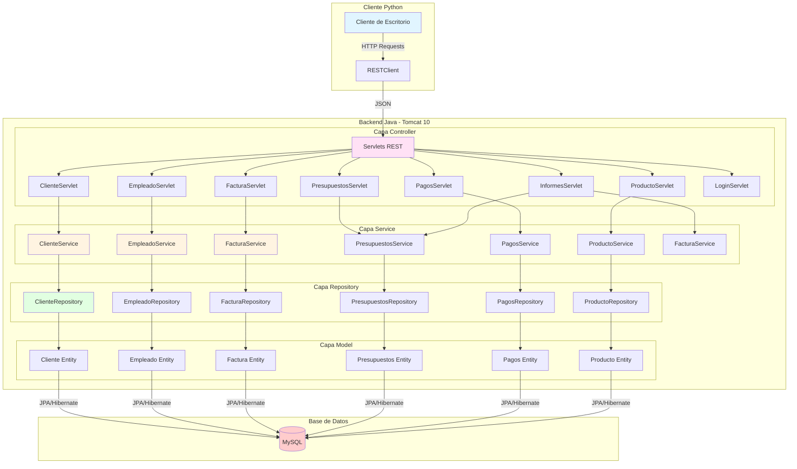
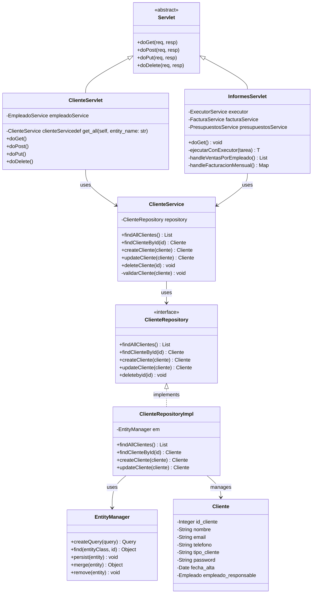
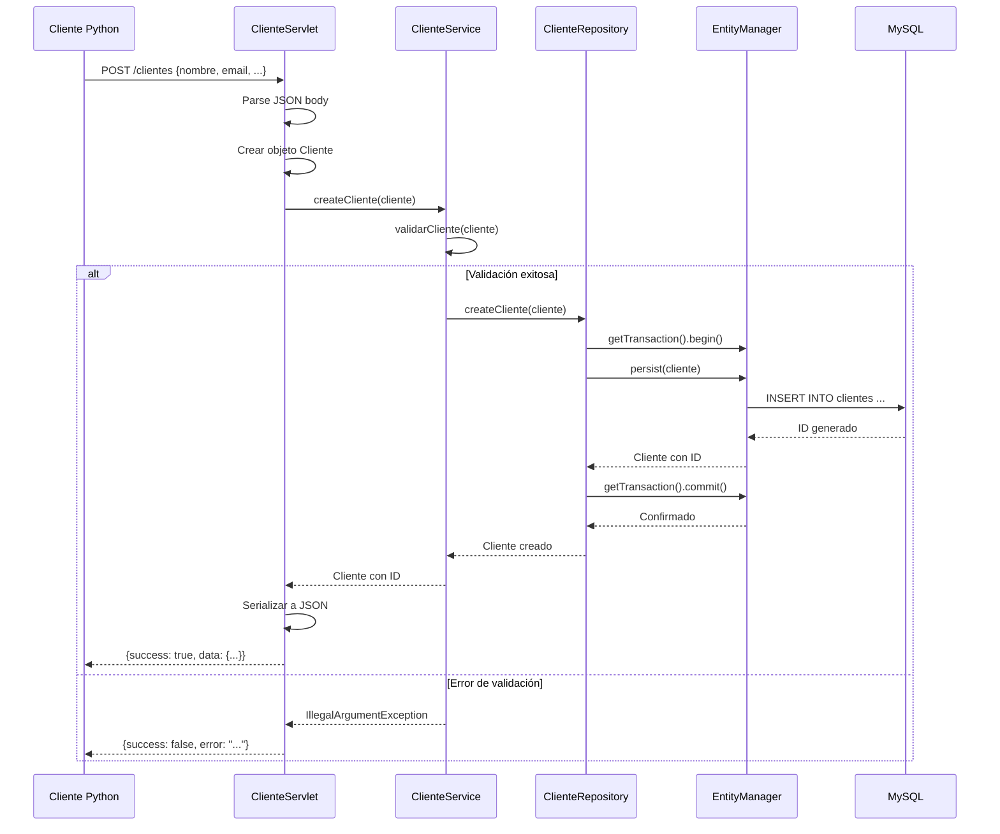
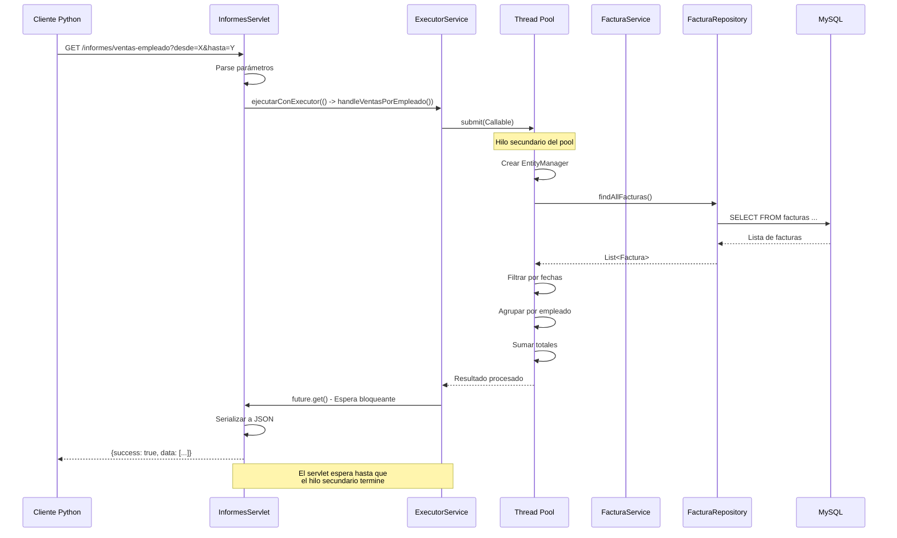
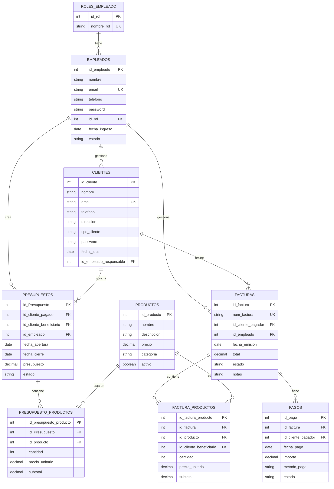
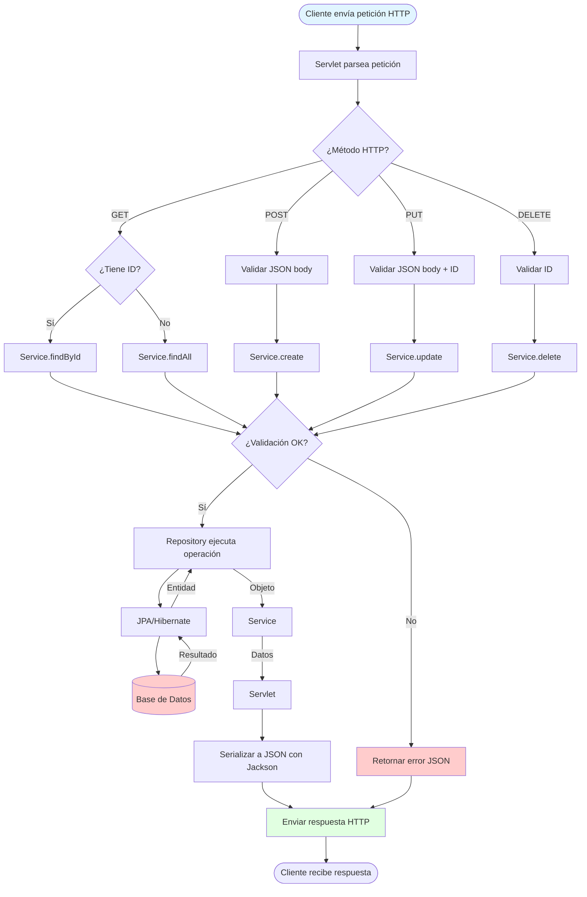
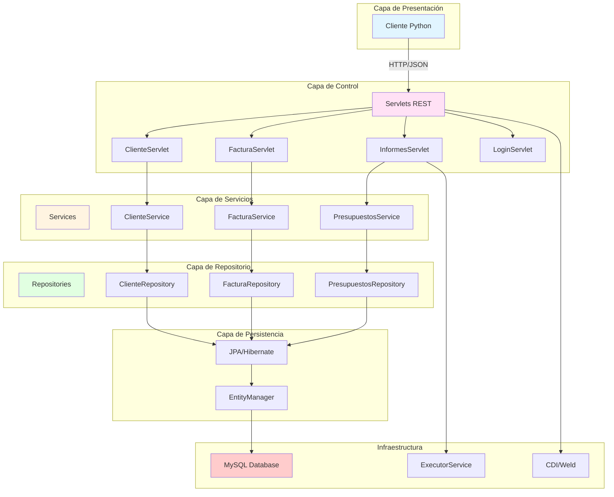
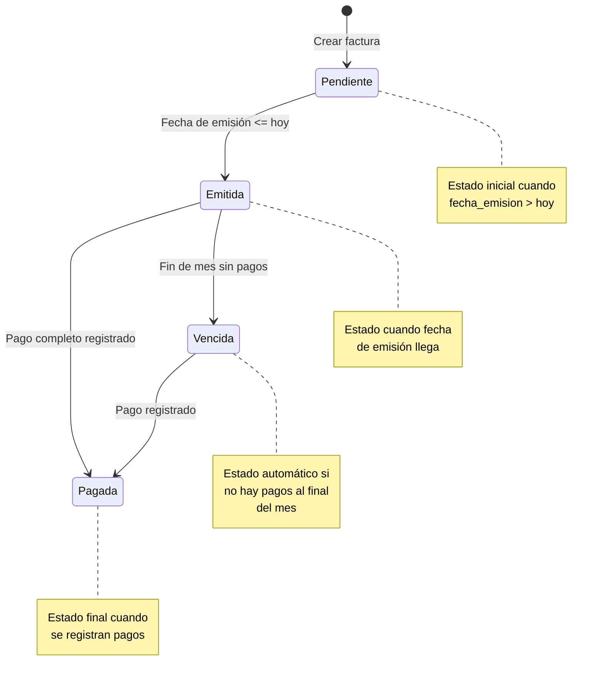
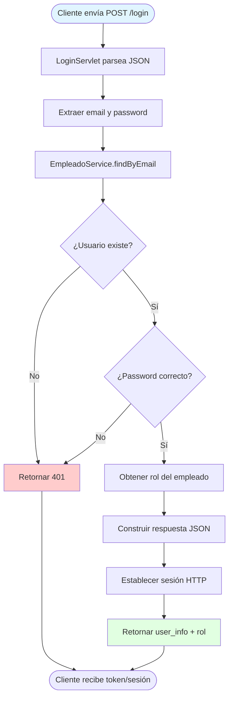
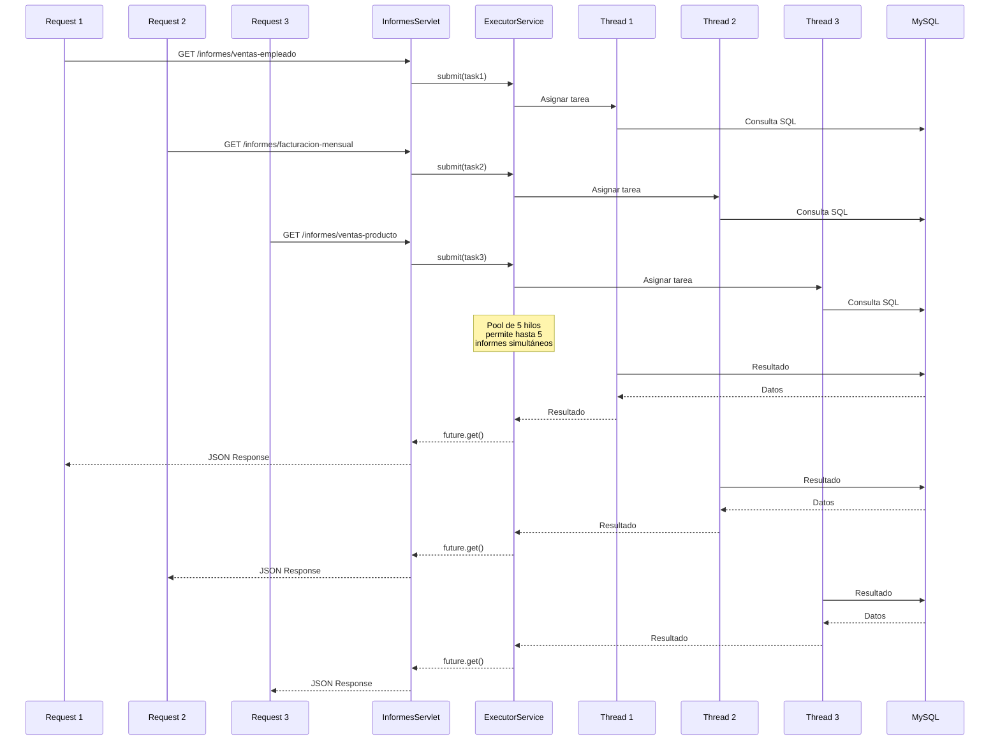

# Diagramas del Sistema - CRUDXTART Backend

Este documento contiene diagramas UML, ER y de flujo que representan la arquitectura y funcionamiento del backend Java CRUDXTART.

## Extensiones Recomendadas

### **Para VS Code**

#### **Markdown Preview Mermaid Support**
Permite que VS Code renderice diagramas Mermaid dentro de archivos Markdown.

#### **Mermaid Markdown Syntax Highlighting**
Añade sintaxis coloreada y reconocimiento de bloques Mermaid.

**Cómo Instalarlas en VS Code:**
1. Abrir **VS Code**.
2. Pulsar **Ctrl + Shift + X** para abrir el panel de extensiones.
3. Buscar cada extensión por su nombre exacto.
4. Pulsar **Install**.

Tras instalarlas, VS Code será capaz de renderizar los diagramas Mermaid integrados en el proyecto.

**Visualizar Diagramas en VS Code:**
1. Abrir el archivo que contiene los diagramas.
2. Pulsar:
   **Ctrl + Shift + V** → *Abrir vista previa Markdown*.
3. Los diagramas Mermaid se renderizan automáticamente en la vista previa.

---

### **Para IntelliJ IDEA**

#### **Opción 1: Plugin Mermaid (Recomendado)**

**Instalación:**
1. Abrir **IntelliJ IDEA**.
2. Ir a `File` → `Settings` (o `IntelliJ IDEA` → `Preferences` en Mac).
3. Navegar a `Plugins` → `Marketplace`.
4. Buscar "**Mermaid**" o "**Mermaid Support**".
5. Instalar uno de los plugins disponibles:
   - **Mermaid** (por JetBrains o desarrolladores de la comunidad)
   - **Mermaid Support**
   - **Markdown Mermaid Support**

**Uso:**
1. Abrir el archivo `.md` con diagramas Mermaid.
2. Abrir la vista previa de Markdown:
   - **Windows/Linux**: `Ctrl + Alt + P`
   - **Mac**: `Cmd + Alt + P`
   - O clic derecho en el archivo → `Open Preview`
3. Los diagramas Mermaid deberían renderizarse en la vista previa.

#### **Opción 2: Plugin Markdown Navigator Enhanced**

**Instalación:**
1. `Settings` → `Plugins` → `Marketplace`.
2. Buscar "**Markdown Navigator Enhanced**" o "**Markdown**".
3. Instalar el plugin (suele incluir soporte Mermaid).

**Uso:**
- Abrir el archivo `.md` y activar la vista previa.
- Los diagramas Mermaid se renderizan automáticamente.

#### **Opción 3: Visualización Externa (Si no funciona en IntelliJ)**

Si los plugins no funcionan correctamente, puedes usar herramientas externas:

**Mermaid Live Editor (Navegador):**
1. Abrir https://mermaid.live en tu navegador.
2. Copiar el código del diagrama (entre ```mermaid y ```).
3. Pegarlo en el editor.
4. El diagrama se renderiza automáticamente.
5. Opcional: Exportar como PNG/SVG desde el menú `Actions`.

**Exportar a Imagen:**
- En Mermaid Live Editor: `Actions` → `Download PNG` o `Download SVG`.
- Útil para incluir imágenes en documentación o presentaciones.

#### **Verificación Rápida en IntelliJ:**

Si ya tienes un plugin instalado:
1. Abrir `DIAGRAMAS.md` en IntelliJ.
2. Presionar `Ctrl + Alt + P` (o `Cmd + Alt + P` en Mac) para abrir la vista previa.
3. O clic derecho en el archivo → `Open Preview`.

Si los diagramas no se renderizan:
- Verificar que el plugin esté activado en `Settings` → `Plugins` → `Installed`.
- Reiniciar IntelliJ IDEA.
- Probar con otro plugin de Mermaid.

---

## 1. Diagrama de Arquitectura General



---

## 2. Diagrama de Clases UML - Arquitectura en Capas



---

## 3. Diagrama de Secuencia - Operación CRUD (Crear Cliente)



---

## 4. Diagrama de Secuencia - Generación de Informe con Concurrencia



---

## 5. Diagrama Entidad-Relación (Base de Datos)



---

## 6. Diagrama de Flujo - Procesamiento de Petición REST



---

## 7. Diagrama de Componentes - Arquitectura del Sistema



---

## 8. Diagrama de Paquetes - Estructura Modular

```mermaid
graph TB
    subgraph "com.example.crudxtart"
        subgraph "controller"
            A1[ClienteServlet]
            A2[EmpleadoServlet]
            A3[FacturaServlet]
            A4[PresupuestosServlet]
            A5[PagosServlet]
            A6[ProductoServlet]
            A7[InformesServlet]
            A8[LoginServlet]
            A9[RolesEmpleadoServlet]
            A10[FacturaProductoServlet]
        end
        
        subgraph "service"
            B1[ClienteService]
            B2[EmpleadoService]
            B3[FacturaService]
            B4[PresupuestosService]
            B5[PagosService]
            B6[ProductoService]
            B7[Roles_empleadoService]
            B8[FacturaProductoService]
        end
        
        subgraph "repository"
            C1[ClienteRepository]
            C2[ClienteRepositoryImpl]
            C3[FacturaRepository]
            C4[FacturaRepositoryImpl]
            C5[PresupuestosRepository]
            C6[PresupuestosRepositoryImpl]
        end
        
        subgraph "models"
            D1[Cliente]
            D2[Empleado]
            D3[Factura]
            D4[Presupuestos]
            D5[Pagos]
            D6[Producto]
            D7[FacturaProducto]
            D8[PresupuestoProducto]
            D9[Roles_empleado]
        end
        
        subgraph "config"
            E1[JpaFactory]
        end
        
        subgraph "utils"
            F1[JsonUtil]
        end
    end
    
    A1 --> B1
    A3 --> B3
    A4 --> B4
    
    B1 --> C1
    B3 --> C3
    B4 --> C5
    
    C1 <|.. C2
    C3 <|.. C4
    C5 <|.. C6
    
    C2 --> D1
    C4 --> D3
    C6 --> D4
    
    A1 --> F1
    A3 --> F1
    
    style A1 fill:#ffe1f5
    style B1 fill:#fff4e1
    style C2 fill:#e1ffe1
    style D1 fill:#e1f5ff
```

---

## 9. Diagrama de Estados - Ciclo de Vida de una Factura



---

## 10. Diagrama de Flujo - Autenticación y Autorización



---

## 11. Diagrama de Concurrencia - Pool de Hilos en Informes



---

## Notas sobre los Diagramas

### Diagrama de Arquitectura General
Muestra la estructura en capas del sistema y cómo fluyen las peticiones desde el cliente hasta la base de datos.

### Diagrama de Clases UML
Representa las clases principales, sus relaciones de herencia, composición y dependencias mediante inyección CDI.

### Diagramas de Secuencia
Ilustran la interacción temporal entre componentes durante operaciones CRUD y generación de informes con concurrencia.

### Diagrama ER
Muestra el esquema completo de la base de datos con todas las relaciones entre entidades.

### Diagramas de Flujo
Describen los procesos de negocio desde la recepción de peticiones hasta la generación de respuestas.

### Diagrama de Estados
Muestra las transiciones de estado de una factura según las reglas de negocio implementadas.

### Diagrama de Concurrencia
Explica cómo el ExecutorService maneja múltiples peticiones de informes en paralelo.

---

## Herramientas para Visualizar

Estos diagramas están escritos en **Mermaid**, que puede visualizarse en:
- GitHub (renderizado automático en archivos .md)
- GitLab
- VS Code (con extensión Mermaid)
- Documentación online (Mermaid Live Editor: https://mermaid.live)
- Herramientas de documentación como MkDocs, Docusaurus, etc.

Para exportar a otros formatos (PNG, SVG, PDF), puedes usar:
- Mermaid CLI: `npm install -g @mermaid-js/mermaid-cli`
- Herramientas online de conversión
- Extensiones de VS Code que permiten exportar

